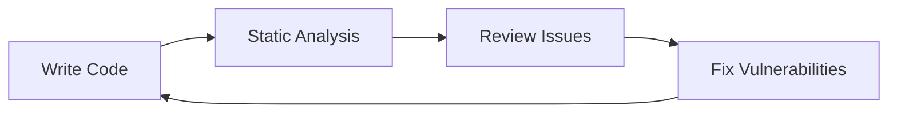

# CodeGuard Usage Guide

This guide provides detailed instructions on how to use CodeGuard effectively for C/C++ security analysis, from basic usage to advanced workflows.

## Table of Contents

- [Getting Started](#getting-started)
- [Static Analysis](#static-analysis)
- [Dynamic Analysis](#dynamic-analysis)
- [Configuration](#configuration)
- [Workflows](#workflows)
- [Advanced Features](#advanced-features)
- [Best Practices](#best-practices)
- [Troubleshooting](#troubleshooting)

## Getting Started

### First Run

1. **Open a C/C++ Project**:
   ```bash
   code your-cpp-project/
   ```

2. **Verify Extension Activation**:
   - The CodeGuard extension should activate automatically for `.c` and `.cpp` files
   - Check the status bar for "CodeGuard" indicator
   - Look for the CodeGuard icon in the activity bar

3. **Check Initial Analysis**:
   - Static analysis begins automatically
   - Look for diagnostic messages in the Problems panel
   - Check the Output panel for analysis logs

### Basic Interface

#### Status Bar
- **CodeGuard Status**: Shows current analysis state
- **Analysis Progress**: Displays progress indicators during analysis
- **Quick Actions**: Right-click for common actions

#### Command Palette
Access CodeGuard commands via `Ctrl+Shift+P` (or `Cmd+Shift+P` on macOS):
- `Run AddressSanitizer`: Execute dynamic analysis
- `Cancel AddressSanitizer`: Stop ongoing analysis
- `Sign Up`: Register for enhanced features
- `Restart Extension`: Restart the extension

#### Output Panels
- **CodeGuard**: General extension logs
- **Static Analysis**: Static analysis results and errors
- **Dynamic Analysis**: Dynamic analysis results and logs
- **SARIF Viewer**: Detailed vulnerability reports

## Static Analysis

### Automatic Analysis

Static analysis runs automatically when you:
- Open a C/C++ file
- Modify code in an open file
- Save a file

#### Analysis Behavior
```json
// Configuration for analysis timing
{
  "AiBugHunter.diagnostics.delayBeforeAnalysis": 1500,  // 1.5 seconds
  "AiBugHunter.diagnostics.maxNumberOfLines": 1         // Top 1 vulnerable line
}
```

#### Real-time Feedback
- **Inline Diagnostics**: Vulnerabilities appear as underlines in the editor
- **Problems Panel**: Detailed list of all detected issues
- **Hover Information**: Detailed vulnerability information on hover

### Vulnerability Types

#### CWE Categories Detected

| CWE ID | Category | Description | Example |
|--------|----------|-------------|---------|
| CWE-119 | Buffer Overflow | Memory access outside bounds | `strcpy(buffer, large_string)` |
| CWE-120 | Buffer Copy | Unsafe memory operations | `memcpy(dest, src, size)` |
| CWE-125 | Out-of-bounds Read | Reading beyond buffer | `array[index]` where `index >= size` |
| CWE-190 | Integer Overflow | Arithmetic overflow | `int result = a + b` |
| CWE-787 | Out-of-bounds Write | Writing beyond buffer | `array[index] = value` |
| CWE-415 | Double Free | Multiple deallocations | `free(ptr); free(ptr);` |
| CWE-416 | Use After Free | Accessing freed memory | `free(ptr); *ptr = value;` |

#### Severity Levels

- **Critical**: Immediate security risk, requires immediate attention
- **High**: Significant security vulnerability, should be fixed soon
- **Medium**: Moderate security concern, should be addressed
- **Low**: Minor security issue, consider fixing

### Configuration Options

#### Analysis Sensitivity
```json
{
  "AiBugHunter.diagnostics.informationLevel": "Verbose",  // or "Fluent"
  "AiBugHunter.diagnostics.highlightSeverityType": "Error",
  "AiBugHunter.diagnostics.showDescription": true
}
```

#### Display Options
```json
{
  "AiBugHunter.diagnostics.diagnosticMessageInformation": [
    "lineNumber",
    "cweID",
    "cweType",
    "cweSummary",
    "severityLevel",
    "severityScore"
  ]
}
```

### Example Static Analysis Session

```cpp
// Example vulnerable code
#include <iostream>
#include <cstring>

class VulnerableClass {
private:
    char* buffer;
    int size;
    
public:
    VulnerableClass(int bufferSize) {
        size = bufferSize;
        buffer = new char[size];
    }
    
    void copyData(const char* data) {
        strcpy(buffer, data);  // CWE-119: Buffer overflow
    }
    
    void processData(int index) {
        if (index < size) {
            buffer[index] = 'A';  // CWE-125: Out-of-bounds read potential
        }
    }
    
    ~VulnerableClass() {
        delete[] buffer;
        delete[] buffer;  // CWE-415: Double free
    }
};

int main() {
    VulnerableClass obj(10);
    obj.copyData("This string is too long for the buffer");
    obj.processData(15);
    return 0;
}
```

**Expected Static Analysis Results**:
- Line 15: CWE-119 (Buffer Overflow) - High Severity
- Line 20: CWE-125 (Out-of-bounds Read) - Medium Severity  
- Line 26: CWE-415 (Double Free) - Critical Severity

## Dynamic Analysis

### Running Dynamic Analysis

#### Method 1: Command Palette
1. Press `Ctrl+Shift+P` (or `Cmd+Shift+P` on macOS)
2. Type "Run AddressSanitizer"
3. Select the command
4. Wait for analysis to complete

#### Method 2: Status Bar
1. Right-click on the CodeGuard status bar item
2. Select "Run Dynamic Analysis"
3. Monitor progress in the Output panel

#### Method 3: Keyboard Shortcut
- Configure custom keyboard shortcuts in VS Code settings

### Analysis Configuration

#### Compiler Flags
```bash
# Required AddressSanitizer flags
-fsanitize=address
-fno-omit-frame-pointer
-g
-O1

# Additional useful flags
-Wall -Wextra -Werror
-fsanitize=undefined
-fsanitize=leak
```

#### Build Integration
```json
// tasks.json for VS Code
{
  "version": "2.0.0",
  "tasks": [
    {
      "label": "build-with-asan",
      "type": "shell",
      "command": "g++",
      "args": [
        "-fsanitize=address",
        "-fno-omit-frame-pointer",
        "-g",
        "-O1",
        "${file}",
        "-o",
        "${fileBasenameNoExtension}"
      ],
      "group": "build"
    }
  ]
}
```

### Custom Vulnerability Checkers

CodeGuard includes specialized checkers for:

#### 1. Memory Leak Detection
```cpp
// Example that should trigger memory leak detection
void memory_leak_example() {
    char* buffer = (char*)malloc(100);
    // Missing free(buffer) - memory leak
}
```

#### 2. Use-After-Free Detection
```cpp
// Example that should trigger use-after-free detection
void use_after_free_example() {
    char* buffer = (char*)malloc(100);
    free(buffer);
    strcpy(buffer, "data");  // Use after free
}
```

#### 3. Double-Free Detection
```cpp
// Example that should trigger double-free detection
void double_free_example() {
    char* buffer = (char*)malloc(100);
    free(buffer);
    free(buffer);  // Double free
}
```

### SARIF Reports

#### Understanding SARIF Output
```json
{
  "version": "2.1.0",
  "runs": [
    {
      "tool": {
        "driver": {
          "name": "CodeGuard Dynamic Analysis",
          "version": "1.0.0"
        }
      },
      "results": [
        {
          "ruleId": "CWE-415",
          "level": "error",
          "message": {
            "text": "Double free detected"
          },
          "locations": [
            {
              "physicalLocation": {
                "artifactLocation": {
                  "uri": "file:///path/to/file.cpp"
                },
                "region": {
                  "startLine": 10,
                  "startColumn": 5
                }
              }
            }
          ]
        }
      ]
    }
  ]
}
```

#### Viewing SARIF Reports
1. Open the SARIF Viewer panel
2. Load generated SARIF files
3. Navigate through detected issues
4. Export reports for external tools

## Configuration

### Extension Settings

#### Static Analysis Settings
```json
{
  "AiBugHunter.inference.inferenceMode": "Local",
  "AiBugHunter.inference.useCUDA": false,
  "AiBugHunter.inference.inferenceServerURL": "http://localhost:5000",
  "AiBugHunter.diagnostics.delayBeforeAnalysis": 1500,
  "AiBugHunter.diagnostics.maxNumberOfLines": 1,
  "AiBugHunter.diagnostics.highlightSeverityType": "Error",
  "AiBugHunter.diagnostics.informationLevel": "Verbose",
  "AiBugHunter.diagnostics.showDescription": true,
  "AiBugHunter.diagnostics.diagnosticMessageInformation": [
    "lineNumber",
    "cweID",
    "cweType",
    "cweSummary",
    "severityLevel",
    "severityScore"
  ]
}
```

#### Dynamic Analysis Settings
```json
{
  "secure-code-analyzer.apiUrl": "http://localhost:3000",
  "secure-code-analyzer.enableRealTimeAnalysis": true,
  "secure-code-analyzer.sarifOutputPath": "./analysis-results",
  "secure-code-analyzer.timeout": 30000,
  "secure-code-analyzer.logLevel": "info",
  "secure-code-analyzer.compilerFlags": [
    "-fsanitize=address",
    "-fno-omit-frame-pointer",
    "-g",
    "-O1"
  ]
}
```

### Workspace Configuration

#### .vscode/settings.json
```json
{
  "files.associations": {
    "*.cpp": "cpp",
    "*.c": "c",
    "*.h": "cpp",
    "*.hpp": "cpp"
  },
  "C_Cpp.default.compilerPath": "/usr/bin/g++",
  "C_Cpp.default.cStandard": "c17",
  "C_Cpp.default.cppStandard": "c++17"
}
```

#### .vscode/tasks.json
```json
{
  "version": "2.0.0",
  "tasks": [
    {
      "label": "CodeGuard Analysis",
      "type": "shell",
      "command": "codeguard",
      "args": ["analyze", "${workspaceFolder}"],
      "group": "build",
      "presentation": {
        "echo": true,
        "reveal": "always",
        "focus": false,
        "panel": "shared"
      }
    }
  ]
}
```

## Workflows

### Development Workflow

#### 1. Real-time Development


#### 2. Pre-commit Analysis
```bash
# Run comprehensive analysis before committing
codeguard analyze --static --dynamic --output sarif
```

#### 3. Continuous Integration
```yaml
# .github/workflows/codeguard.yml
name: CodeGuard Analysis
on: [push, pull_request]
jobs:
  analyze:
    runs-on: ubuntu-latest
    steps:
      - uses: actions/checkout@v2
      - name: Run CodeGuard Analysis
        run: |
          codeguard analyze --static --dynamic
          codeguard report --format html
```

### Security Review Workflow

#### 1. Initial Assessment
1. Run static analysis on entire codebase
2. Review high and critical severity issues
3. Document findings in security report

#### 2. Dynamic Testing
1. Compile with AddressSanitizer
2. Run dynamic analysis on test cases
3. Analyze runtime behavior
4. Document memory issues

#### 3. Remediation Planning
1. Prioritize issues by severity and impact
2. Create remediation timeline
3. Assign fixes to development team
4. Track progress in issue management system

### Code Review Integration

#### 1. Pull Request Analysis
```yaml
# GitHub Actions workflow
- name: CodeGuard PR Analysis
  run: |
    codeguard analyze --pr ${{ github.event.pull_request.number }}
    codeguard comment --pr ${{ github.event.pull_request.number }}
```

#### 2. Review Comments
- Automatic comments on vulnerable code
- Severity-based labeling
- Remediation suggestions
- Security context information

## Advanced Features

### Custom Rules

#### 1. Defining Custom Patterns
```json
{
  "customRules": [
    {
      "id": "CUSTOM-001",
      "pattern": "strcpy\\(.*,.*\\)",
      "message": "Use strncpy instead of strcpy",
      "severity": "warning",
      "remediation": "Replace strcpy with strncpy and specify buffer size"
    }
  ]
}
```

#### 2. Rule Configuration
```json
{
  "ruleEngine": {
    "enableCustomRules": true,
    "customRulesPath": "./custom-rules.json",
    "rulePriority": "custom,builtin"
  }
}
```

### Integration with External Tools

#### 1. SonarQube Integration
```bash
# Export results to SonarQube format
codeguard export --format sonar --output sonar-results.json
```

#### 2. Jenkins Integration
```groovy
// Jenkins pipeline
stage('Security Analysis') {
    steps {
        sh 'codeguard analyze --static --dynamic'
        publishHTML([
            allowMissing: false,
            alwaysLinkToLastBuild: true,
            keepAll: true,
            reportDir: 'analysis-results',
            reportFiles: 'index.html',
            reportName: 'CodeGuard Report'
        ])
    }
}
```

#### 3. JIRA Integration
```bash
# Create JIRA issues for vulnerabilities
codeguard jira --project SEC --component security
```

### Performance Optimization

#### 1. Analysis Caching
```json
{
  "cache": {
    "enableCaching": true,
    "cacheDirectory": "./.codeguard-cache",
    "cacheExpiry": 3600
  }
}
```

#### 2. Parallel Processing
```json
{
  "performance": {
    "maxConcurrentAnalyses": 4,
    "analysisTimeout": 300,
    "memoryLimit": "2GB"
  }
}
```

## Best Practices

### Code Organization

#### 1. Project Structure
```
project/
├── src/
│   ├── main.cpp
│   ├── vulnerable.cpp
│   └── secure.cpp
├── tests/
│   ├── unit/
│   └── integration/
├── analysis-results/
├── .codeguard/
└── docs/
```

#### 2. Analysis Configuration
```json
// .codeguard/config.json
{
  "analysis": {
    "include": ["src/**/*.cpp", "src/**/*.c"],
    "exclude": ["tests/**/*", "vendor/**/*"],
    "severityThreshold": "medium"
  }
}
```

### Security Practices

#### 1. Regular Analysis
- Run analysis on every code change
- Schedule periodic full codebase scans
- Review and address findings promptly

#### 2. Remediation Priority
1. **Critical**: Fix immediately
2. **High**: Fix within 1-2 days
3. **Medium**: Fix within 1 week
4. **Low**: Fix within 1 month

#### 3. Documentation
- Document security decisions
- Maintain security review logs
- Track remediation progress

### Team Collaboration

#### 1. Code Review Process
- Require security analysis for all PRs
- Use automated security checks
- Include security experts in reviews

#### 2. Training and Awareness
- Regular security training sessions
- Share security best practices
- Review security incidents

## Troubleshooting

### Common Issues

#### 1. Analysis Not Running
**Symptoms**: No analysis results appear
**Solutions**:
- Check file associations
- Verify extension activation
- Review configuration settings
- Check for errors in Output panel

#### 2. False Positives
**Symptoms**: Incorrect vulnerability reports
**Solutions**:
- Adjust analysis sensitivity
- Add custom rules for known patterns
- Use suppression comments
- Report issues to development team

#### 3. Performance Issues
**Symptoms**: Slow analysis or high resource usage
**Solutions**:
- Enable caching
- Reduce analysis scope
- Use remote inference
- Optimize configuration

### Debug Mode

#### 1. Enable Debug Logging
```json
{
  "secure-code-analyzer.logLevel": "debug",
  "AiBugHunter.diagnostics.informationLevel": "Verbose"
}
```

#### 2. Debug Commands
```bash
# Check extension status
codeguard status

# Validate configuration
codeguard validate

# Run analysis with debug output
codeguard analyze --debug
```

### Getting Help

#### 1. Documentation
- [Architecture Guide](docs/ARCHITECTURE.md)
- [Installation Guide](docs/INSTALLATION.md)
- [API Reference](docs/API.md)

#### 2. Community Support
- [GitHub Issues](https://github.com/hoda39/CodeGuard/issues)
- [GitHub Discussions](https://github.com/hoda39/CodeGuard/discussions)
- [Security Advisories](SECURITY.md)

#### 3. Professional Support
- Enterprise support available
- Custom integration services
- Training and consulting

## Conclusion

CodeGuard provides comprehensive security analysis capabilities for C/C++ development. By following this usage guide and implementing the recommended workflows, you can significantly improve the security posture of your codebase while maintaining development productivity.

Remember to:
- Run analysis regularly
- Address high-priority issues promptly
- Integrate security into your development workflow
- Stay updated with the latest security best practices
- Contribute to the community and share your experiences 