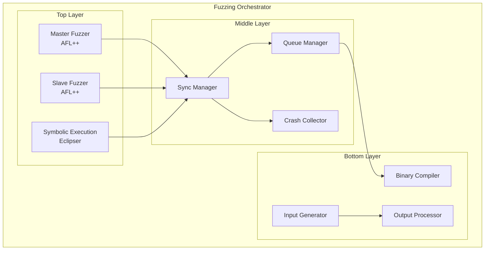
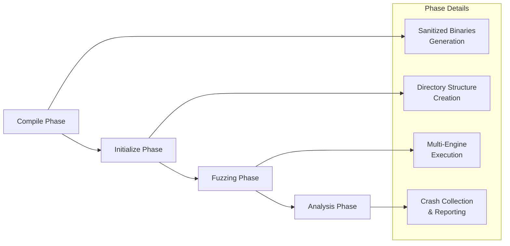
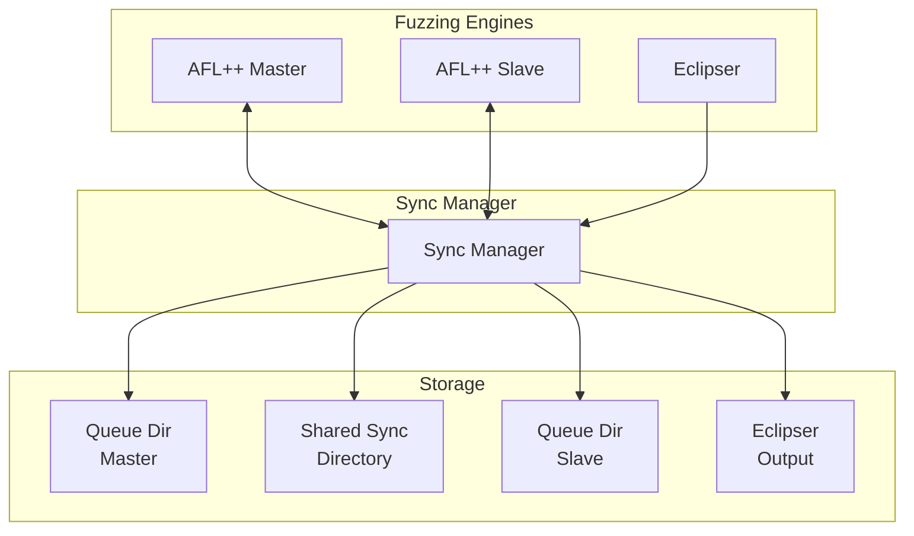
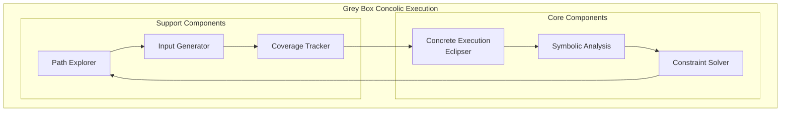
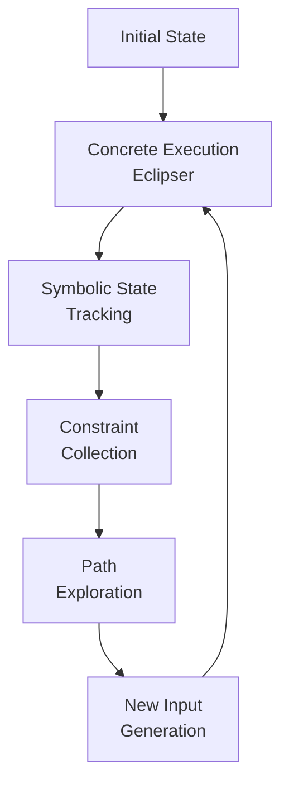
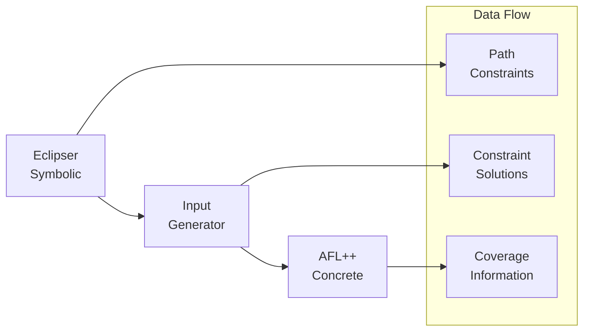
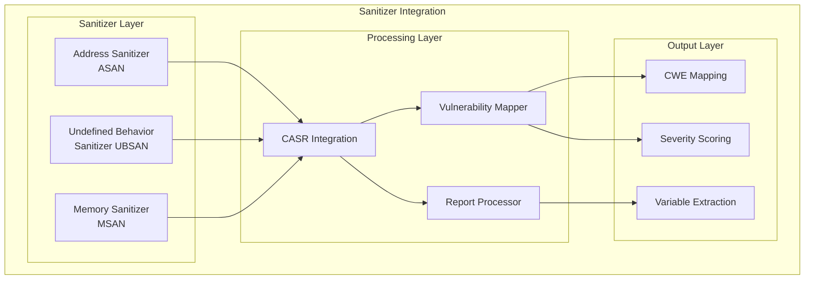
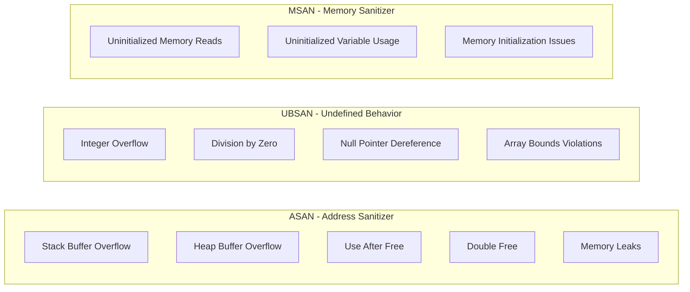
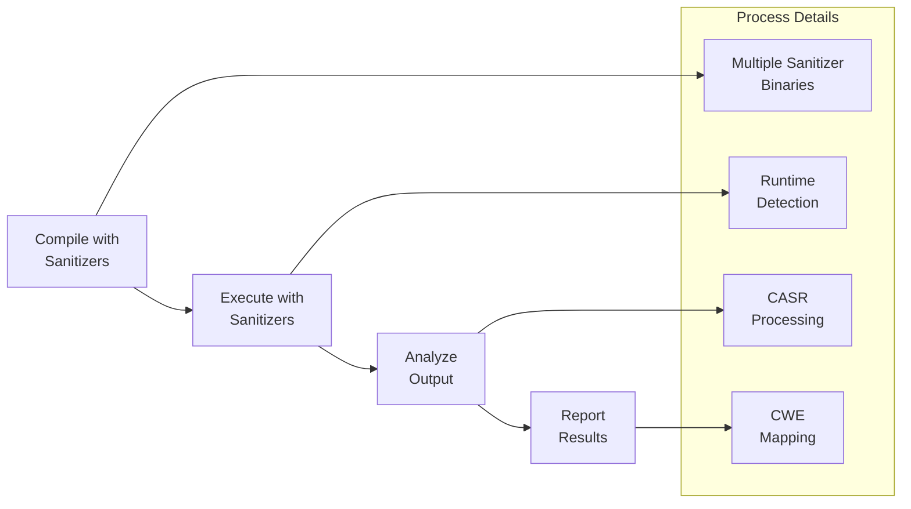
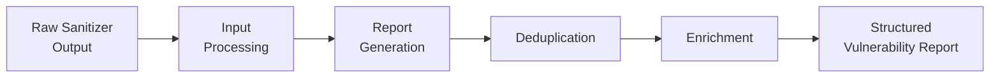

# Mermaid Diagrams for Dynamic Analysis Chapter

## 1. Fuzzing Orchestrator Architecture



## 2. Workflow Design



## 3. Synchronization Mechanism



## 4. Grey Box Concolic Execution



## 5. Execution Model



## 6. Integration with Fuzzing Engines



## 7. Sanitizer Integration Architecture



## 8. Sanitizer Types and Capabilities



## 9. Integration Workflow



## 10. CASR Processing Pipeline



## How to Convert These to Images:

### Option 1: Online Mermaid Editor
1. Go to: https://mermaid.live/
2. Copy any diagram code above
3. Paste into the editor
4. Click "Download PNG" or "Download SVG"

### Option 2: Mermaid CLI (Command Line)
```bash
# Install mermaid-cli
npm install -g @mermaid-js/mermaid-cli

# Convert to PNG
mmdc -i diagram.mmd -o diagram.png

# Convert to SVG
mmdc -i diagram.mmd -o diagram.svg
```

### Option 3: GitHub Integration
- GitHub automatically renders Mermaid diagrams in markdown
- Just paste the code in your markdown file

### Option 4: VS Code Extension
- Install "Mermaid Preview" extension
- Right-click on .mmd file → "Open Preview"
- Export as image 